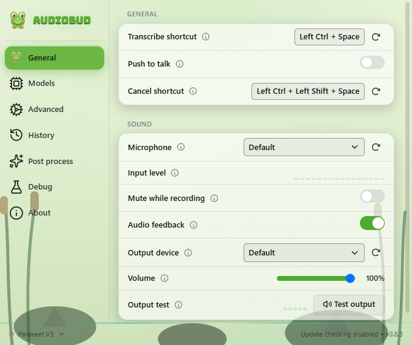
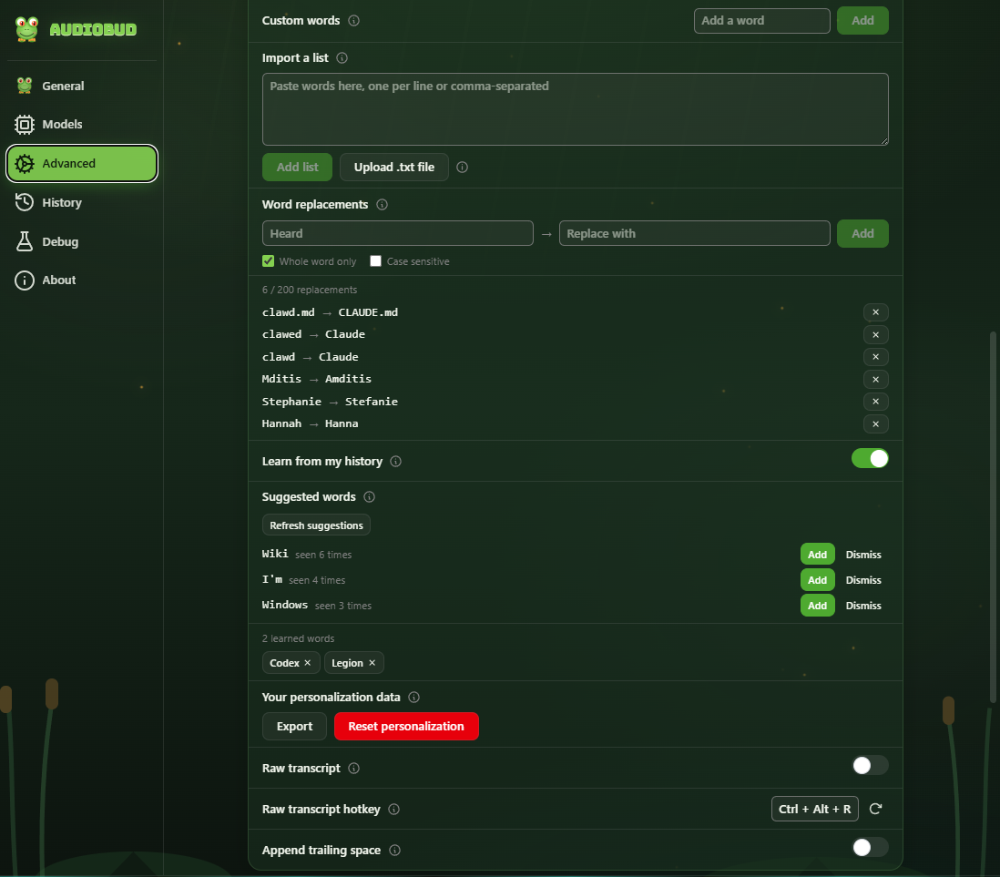
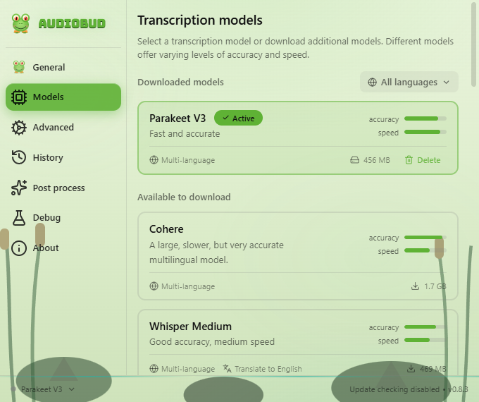

# AudioBud

AudioBud is a local-first dictation app for Windows. Hold a hotkey, speak, and AudioBud types the transcript into the focused text field. Audio stays on your machine unless you explicitly enable optional LLM post-processing.

AudioBud is a detached fork of [Handy](https://github.com/cjpais/Handy) by CJ Pais. It keeps Handy's Tauri, Rust, React, and local transcription base while adding AudioBud defaults, a dark frog/swamp interface, a Windows-first release path, and local model choices tuned for this fork.

- **Website:** <https://audiobud.amditis.tech/>
- **Privacy:** <https://audiobud.amditis.tech/privacy.html>
- **Terms:** <https://audiobud.amditis.tech/terms.html>
- **Support:** <https://github.com/jamditis/audiobud/issues>
- **Download:** [latest release](https://github.com/jamditis/audiobud/releases/latest)
- **Changelog:** [CHANGELOG.md](CHANGELOG.md)



## Current status

AudioBud is packaged for Windows x64; the current version is whatever the [latest release](https://github.com/jamditis/audiobud/releases/latest) says. Beginning with v0.4.0, Windows release installers are signed and timestamped through Microsoft Artifact Signing. The signature identifies Joseph Amditis as the publisher. SmartScreen can still show a reputation warning while a new release builds reputation.

Windows is the validated target for this milestone. macOS and Linux code is inherited from Handy and may work, but this fork has not validated those builds yet.

Automatic update checks remain disabled because AudioBud does not yet publish a signed updater feed. Download releases manually until that feed is ready.

## How it works

1. Hold the default Windows shortcut, `Ctrl+Alt+Space`, to record. You can switch from push-to-talk to toggle mode in settings.
2. AudioBud records from your selected microphone and trims silence with Silero VAD.
3. The selected local model transcribes the audio.
4. AudioBud inserts the result into the focused app by clipboard paste or direct typing.

## What you can configure

- **Shortcuts:** transcribe, transcribe with post-processing, raw transcript, and cancel bindings.
- **Recording mode:** push-to-talk or toggle recording.
- **Audio:** microphone, output device, input meter, audio feedback, volume, and mute-while-recording.
- **Models:** Parakeet, Whisper, Moonshine, SenseVoice, GigaAM, Canary, Cohere, and custom Whisper GGML `.bin` files.
- **Text output:** spoken-number formatting (digits, currency, and percentages), a tray switch between formatted and raw transcript output, language selection where supported, translation where supported, trailing spaces, paste method, clipboard handling, and raw lowercased output.
- **Vocabulary:** custom words plus deterministic word replacements for names, jargon, and common mishears.
- **Personalization (opt-in):** on-device learning from your own dictation history -- frequently used words offered as suggestions you accept or dismiss and then applied to later dictations, with view, export, and reset controls for everything it has learned.
- **Post-processing:** optional cleanup through OpenAI, Anthropic, Z.AI, OpenRouter, Groq, Cerebras, AWS Bedrock via Mantle, or a custom OpenAI-compatible endpoint. API keys stay in local settings.
- **History:** recent transcriptions, recording retention, retry, and saved entries.
- **Advanced controls:** autostart, tray icon, overlay position, model unload timeout, Whisper acceleration, ONNX acceleration, GPU selection, logging, and debug paths.

## Personalization

Opt in to let AudioBud learn from your own dictation history, entirely on your machine. Turn on **Learn from my history** and it mines your past transcriptions for words you use often and offers them as suggestions; the ones you accept are added to your dictionary and applied to later dictations. It stays off until you enable it, and you can view, export, or reset everything it has learned at any time -- even while the feature is off.



## Models

Parakeet V3 is the Windows default in this fork because it was the best small local engine in the milestone A benchmark. See [bench/RESULTS.md](bench/RESULTS.md).



| Engine      | Best fit                                      | Notes                                                         |
| ----------- | --------------------------------------------- | ------------------------------------------------------------- |
| Parakeet V3 | Default Windows dictation                     | Fast multilingual ONNX model with DirectML support.           |
| Whisper     | Broad language coverage                       | Small, medium, turbo, and large variants through whisper.cpp. |
| Moonshine   | Small English models                          | Very fast English-focused options.                            |
| SenseVoice  | Chinese, English, Japanese, Korean, Cantonese | Good option for East Asian language coverage.                 |
| GigaAM      | Russian                                       | Russian speech recognition.                                   |
| Canary      | Multilingual and translation                  | 180M Flash and 1B v2 options.                                 |
| Cohere      | Accuracy-first multilingual                   | Larger and slower, but accurate.                              |

## Install

Download the Windows installer from the [latest release](https://github.com/jamditis/audiobud/releases/latest):

- `AudioBud_<version>_x64-setup.exe` — the setup wizard, which can install normally or in portable mode
- `AudioBud_<version>_x64_en-US.msi` — the MSI package, for deployment tooling

On first run, choose a model if one is not already installed and grant microphone permission when Windows asks.

## Build from source

Prerequisites: [Rust](https://rustup.rs/), [Bun](https://bun.sh/), and the platform build tools. On Windows, install Visual Studio 2022 with the v143 toolset, the Vulkan SDK, and Ninja. See [BUILD.md](BUILD.md) for platform notes.

```bash
bun install
bun run tauri dev
bun run tauri build
```

For frontend-only work:

```bash
bun run dev
bun run build
bun run lint
bun run test
```

To re-render the README and website screenshots in dark mode:

```bash
bun run screenshots
```

The screenshot script starts Vite, mocks the Tauri command surface with current Windows defaults, captures `screenshots/app-general.png` and `screenshots/models.png`, and refreshes the GitHub Pages image assets.
It installs Playwright's Chromium browser on first run if needed.

## Command-line flags

AudioBud accepts runtime flags for controlling an already-running instance and for changing startup behavior.

```bash
audiobud --toggle-transcription   # toggle recording on or off
audiobud --toggle-post-process    # toggle recording with post-processing
audiobud --cancel                 # cancel the current operation
audiobud --start-hidden           # start without showing the main window
audiobud --no-tray                # start without the system tray icon
audiobud --debug                  # enable verbose logging
audiobud --help                   # list all flags
```

Remote-control flags are sent to the running app through Tauri's single-instance plugin, then the second process exits.

## Manual model installation

Use the in-app downloader when possible. If a proxy or firewall blocks it, install model files by hand.

1. Open **Settings -> About** or debug mode to find the app data directory.
   - Windows: `C:\Users\{username}\AppData\Roaming\tech.amditis.audiobud\`
   - macOS: `~/Library/Application Support/tech.amditis.audiobud/`
   - Linux: `~/.config/tech.amditis.audiobud/`
2. Create a `models` folder inside that directory if needed.
3. Download the model you want:
   - Whisper small: `https://blob.handy.computer/ggml-small.bin`
   - Whisper turbo: `https://blob.handy.computer/ggml-large-v3-turbo.bin`
   - Parakeet V3: `https://blob.handy.computer/parakeet-v3-int8.tar.gz`
4. Place Whisper `.bin` files directly in `models/`.
5. Extract Parakeet archives into `models/`; the extracted folder for Parakeet V3 must be named `parakeet-tdt-0.6b-v3-int8`.
6. Restart AudioBud. Installed models appear under **Settings -> Models**.

Custom Whisper GGML `.bin` files placed in `models/` are auto-discovered. The display name comes from the filename.

## Debug mode

Open debug mode with `Ctrl+Shift+D` on Windows and Linux, or `Cmd+Shift+D` on macOS. It shows app data paths, logs, keyboard implementation settings, recording buffer controls, paste delay, and other diagnostics.

## Project layout

- `src/` - React settings UI, onboarding, model selector, update checker, translations, and overlay frontend.
- `src-tauri/src/` - Rust app setup, managers, Tauri commands, shortcut handling, audio pipeline, transcription pipeline, history, settings, tray, and CLI flags.
- `src-tauri/resources/` - default settings, app resources, and tray assets.
- `docs/` - static GitHub Pages site.
- `screenshots/` - README screenshots generated by `bun run screenshots`.
- `bench/` - benchmark notes and model-selection evidence.

## Acknowledgments

AudioBud builds on [Handy](https://github.com/cjpais/Handy) by CJ Pais and its contributors. It also uses:

- OpenAI Whisper
- whisper.cpp and ggml
- NVIDIA Parakeet
- Silero VAD
- Tauri

## License

MIT. See [LICENSE](LICENSE). AudioBud is a fork of Handy, and the original copyright notice is retained.

The Windows installers also redistribute a few third-party runtime libraries app-locally (the Microsoft Visual C++ runtime, the Vulkan loader, and Microsoft DirectML). Their license notices are in [THIRD_PARTY_NOTICES.md](THIRD_PARTY_NOTICES.md).
