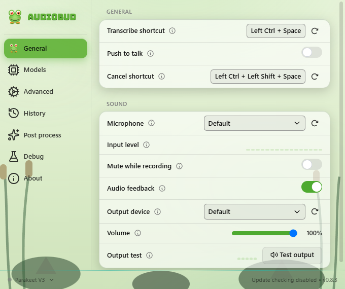
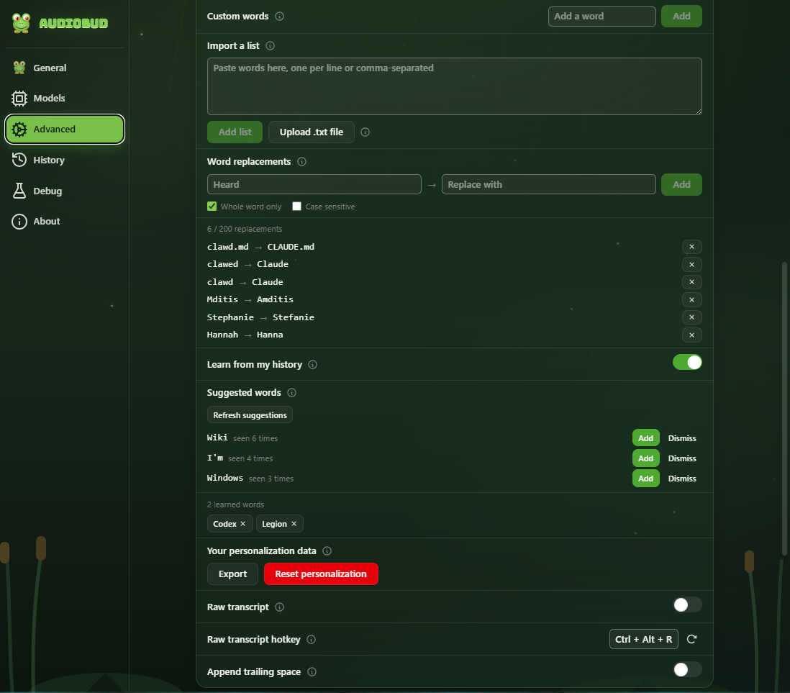
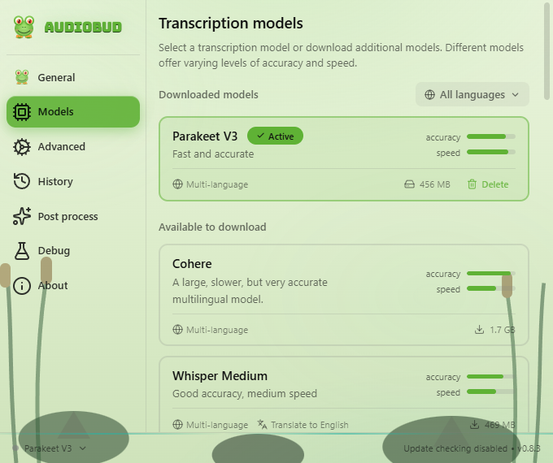

# AudioBud

AudioBud is a local-first dictation app for Windows. Press a hotkey, speak, and AudioBud types the transcript into the focused text field. Audio stays on your machine unless you explicitly enable optional LLM post-processing.

AudioBud is a detached fork of [Handy](https://github.com/cjpais/Handy) by CJ Pais. It keeps Handy's Tauri, Rust, React, and local transcription base while adding AudioBud defaults, a dark frog/swamp interface, a Windows-first release path, and local model choices tuned for this fork.

- **Website:** <https://audiobud.amditis.tech/>
- **Privacy:** <https://audiobud.amditis.tech/privacy.html>
- **Terms:** <https://audiobud.amditis.tech/terms.html>
- **Support:** <https://github.com/jamditis/audiobud/issues>
- **Microsoft Store:** [official listing](https://apps.microsoft.com/detail/xpff8hfmd98gnd) (current v0.4.4 release)
- **Direct downloads:** [latest GitHub release](https://github.com/jamditis/audiobud/releases/latest)
- **Changelog:** [CHANGELOG.md](CHANGELOG.md)



## Current status

AudioBud v0.4.4 is approved and available in the [Microsoft Store](https://apps.microsoft.com/detail/xpff8hfmd98gnd). The Store now delivers the current signed NSIS package, and new Store installs join AudioBud's signed update feed.

Direct GitHub release installers remain available for portable installs, deployment tooling, and users who cannot access the Store listing. Beginning with v0.4.0, Windows release installers are signed and timestamped through Microsoft Artifact Signing. The signature identifies Joseph Amditis as the publisher. SmartScreen can still show a reputation warning for direct downloads while a new release builds reputation.

Windows is the validated target for this milestone. macOS and Linux code is inherited from Handy and may work, but this fork has not validated those builds yet.

Beginning with v0.4.2, installed Windows NSIS builds check AudioBud's signed GitHub release feed for updates by default. You can opt out in Settings > Advanced. The current Microsoft Store package uses that same NSIS update channel. If you installed the original Store v0.4.1 MSI before August 3, 2026, it requires one manual transition onto the current NSIS release; macOS and Linux update behavior remains unvalidated.

## How it works

1. Press the Windows shortcut, `Ctrl+Alt+Space`, to record. In toggle mode, press it again to stop and send the transcript; in hold-to-talk mode, release it to stop.
2. AudioBud records from your selected microphone and trims silence with Silero VAD.
3. The selected local model transcribes the audio.
4. AudioBud inserts the result into the focused app by clipboard paste or direct typing.

## What you can configure

- **Shortcuts:** transcribe, transcribe with post-processing, raw transcript, and cancel bindings.
- **Recording mode:** press-to-toggle recording or hold-to-talk.
- **Audio:** microphone, output device, input meter, audio feedback, volume, and mute-while-recording.
- **Models:** Parakeet, Whisper, Moonshine, SenseVoice, GigaAM, Canary, Cohere, and custom Whisper GGML `.bin` files.
- **Text output:** spoken-number formatting (digits, currency, and percentages), a tray switch between formatted and raw transcript output, language selection where supported, translation where supported, trailing spaces, paste method, clipboard handling, and raw lowercased output.
- **Vocabulary:** custom words plus deterministic word replacements for names, jargon, and common mishears.
- **Output targeting (Windows):** lock dictation to one window so every transcript goes there no matter what you click on next, or send a single dictation to a chosen window without locking. A tray, overlay, and settings indicator shows the active lock with one-click unlock, and a successful delivery names the window it landed in. Per-application output profiles let you override paste method, auto-submit, and clipboard handling for specific apps -- set up by hand in Advanced settings.
- **Personalization (opt-in):** on-device learning from your own dictation history -- frequently used words offered as suggestions you accept or dismiss and then applied to later dictations, with view, export, and reset controls for everything it has learned.
- **Post-processing:** optional cleanup through OpenAI, Anthropic, Z.AI, OpenRouter, Groq, Cerebras, AWS Bedrock via Mantle, or a custom OpenAI-compatible endpoint. API keys stay in local settings.
- **History:** recent transcriptions, recording retention, retry, and saved entries.
- **Advanced controls:** autostart, tray icon, overlay position, model unload timeout, Whisper acceleration, ONNX acceleration, GPU selection, logging, and debug paths.

## Output targeting

Windows only, for now. Applies when your paste method actually sends text to a window -- clipboard paste or typing; `ExternalScript` and `None` decide their own destination and ignore the lock. Lock dictation to a window from the tray or its shortcut, and every transcript goes there until you unlock it, even after you click into something else -- the overlay and settings indicators show the active lock and offer a quick unlock, but don't create one themselves. AudioBud re-checks the pinned window's identity right before it pastes, so most windows closed out from under a lock are caught before the paste lands. If the pinned window has died, you get a lost-target notice instead of a paste into the wrong place. Prefer a one-off? The window picker sends a single dictation to a chosen window without locking anything.

Deliveries run on their own worker thread, so the overlay and tray stay responsive while a paste is in flight, and dictations queue in order if you fire off more than one back to back. A successful pinned or picked delivery names the window it landed in -- a toast in settings, a timed chip on the overlay -- without ever writing that window's title to the log file.

Per-application output profiles (Advanced settings) let you override paste method, auto-submit, and clipboard handling for a named application -- a terminal that wants Shift+Insert with no send key, a chat box that wants Ctrl+V and Enter. Profiles are hand-configured only; nothing detects or suggests one for you yet, and profiles cannot select the external-script paste method.

## Personalization

Opt in to let AudioBud learn from your own dictation history, entirely on your machine. Turn on **Learn from my history** and it mines your past transcriptions for words you use often and offers them as suggestions; the ones you accept are added to your dictionary and applied to later dictations. It stays off until you enable it, and you can view, export, or reset everything it has learned at any time -- even while the feature is off.



## Models

Parakeet V3 is the Windows default in this fork because it was the best small local engine in the milestone A benchmark. See [bench/RESULTS.md](bench/RESULTS.md).



| Engine      | Best fit                                      | Notes                                                         |
| ----------- | --------------------------------------------- | ------------------------------------------------------------- |
| Parakeet V3 | Default Windows dictation                     | Fast multilingual ONNX model with DirectML support.           |
| Whisper     | Broad language coverage                       | Small, medium, turbo, and large variants through whisper.cpp. |
| Moonshine   | Small English models                          | Very fast English-focused options.                            |
| SenseVoice  | Chinese, English, Japanese, Korean, Cantonese | Good option for East Asian language coverage.                 |
| GigaAM      | Russian                                       | Russian speech recognition.                                   |
| Canary      | Multilingual and translation                  | 180M Flash and 1B v2 options.                                 |
| Cohere      | Accuracy-first multilingual                   | Larger and slower, but accurate.                              |

## Install

For U.S. Windows users, install AudioBud from the [Microsoft Store](https://apps.microsoft.com/detail/xpff8hfmd98gnd). The listing serves v0.4.4, and new Store installs check AudioBud's signed update feed for later releases by default.

Signed installers remain available from the [latest GitHub release](https://github.com/jamditis/audiobud/releases/latest) for portable installs, deployment tooling, and users who cannot access the Store:

- `AudioBud_<version>_x64-setup.exe` — the setup wizard, which can install normally or in portable mode
- `AudioBud_<version>_x64_en-US.msi` — the MSI package, for deployment tooling

If you installed AudioBud from the Store before August 3, 2026, open Settings > About and check the version. A v0.4.1 install is the original MSI package and cannot receive the signed in-app updates. Uninstall that copy in Windows Settings, then install from the Store again or run the current NSIS setup executable once. Later releases can then arrive through AudioBud.

On first run, choose a model if one is not already installed and grant microphone permission when Windows asks.

## Verify your download

Edge and SmartScreen warn that a new installer "isn't commonly downloaded" until enough people have fetched that exact build. It is a popularity score rather than a security verdict, and it resets with every release regardless of who signed the file. Two checks confirm you have a genuine AudioBud installer.

Check the signature. Right-click the installer, open **Properties**, then the **Digital Signatures** tab, or run:

```powershell
Get-AuthenticodeSignature .\AudioBud_<version>_x64-setup.exe | Format-List Status, SignerCertificate
```

`Status` must be `Valid` and the signer subject must read `CN=Joseph Amditis, O=Joseph Amditis, L=Bloomfield, S=nj, C=US`, issued by `Microsoft ID Verified CS AOC CA 04`. Microsoft rotates the number ending that issuer, so a different two-digit suffix is expected; the signer subject is the part that must match. Do not run an installer that reports anything else.

Check the hash too, because the signature alone does not cover the whole file. Authenticode hashes the signed parts of a PE image and leaves out the `CheckSum` field, the certificate table, and anything trailing the final section. Patching an excluded byte changes the file's SHA-256 while `Get-AuthenticodeSignature` still returns `Valid` under the correct signer, so treat the two checks as complementary rather than redundant.

Every release asset's SHA-256 digest is published by GitHub on the [releases page](https://github.com/jamditis/audiobud/releases/latest), on the [AudioBud site](https://audiobud.amditis.tech/#verify), and through the API:

```powershell
Get-FileHash -Algorithm SHA256 .\AudioBud_<version>_x64-setup.exe
```

A mismatch means the download was corrupted, tampered with, or replaced in transit. Delete it and download again.

Security reviewers can also use the [GitHub CLI](https://cli.github.com/) to confirm that AudioBud's release workflow produced the downloaded bytes:

```powershell
gh attestation verify .\AudioBud_<version>_x64-setup.exe --repo jamditis/audiobud --signer-workflow jamditis/audiobud/.github/workflows/release.yml
```

The attestation identifies the GitHub build workflow and source commit. It does not replace the signature and hash checks above.

## Build from source

Prerequisites: [Rust](https://rustup.rs/), [Bun](https://bun.sh/), and the platform build tools. On Windows, install Visual Studio 2022 with the v143 toolset, the Vulkan SDK, and Ninja. See [BUILD.md](BUILD.md) for platform notes.

```bash
bun install
bun run tauri dev
bun run tauri build
```

For frontend-only work:

```bash
bun run dev
bun run build
bun run lint
bun run test
```

To re-render the README and website screenshots in dark mode:

```bash
bun run screenshots
```

The screenshot script starts Vite, mocks the Tauri command surface with current Windows defaults, captures `screenshots/app-general.png` and `screenshots/models.png`, and refreshes the GitHub Pages image assets.
It installs Playwright's Chromium browser on first run if needed.

## Command-line flags

AudioBud accepts runtime flags for controlling an already-running instance and for changing startup behavior.

```bash
audiobud --toggle-transcription   # toggle recording on or off
audiobud --toggle-post-process    # toggle recording with post-processing
audiobud --cancel                 # cancel the current operation
audiobud --start-hidden           # start without showing the main window
audiobud --no-tray                # start without the system tray icon
audiobud --debug                  # enable verbose logging
audiobud --help                   # list all flags
```

Remote-control flags are sent to the running app through Tauri's single-instance plugin, then the second process exits.

## Manual model installation

Use the in-app downloader when possible. If a proxy or firewall blocks it, install model files by hand.

1. Open **Settings -> About** or debug mode to find the app data directory.
   - Windows: `C:\Users\{username}\AppData\Roaming\tech.amditis.audiobud\`
   - macOS: `~/Library/Application Support/tech.amditis.audiobud/`
   - Linux: `~/.config/tech.amditis.audiobud/`
2. Create a `models` folder inside that directory if needed.
3. Download the model you want:
   - Whisper small: `https://github.com/jamditis/audiobud/releases/download/model-assets-v1/ggml-small.bin`
   - Whisper turbo: `https://github.com/jamditis/audiobud/releases/download/model-assets-v1/ggml-large-v3-turbo.bin`
   - Parakeet V3: `https://github.com/jamditis/audiobud/releases/download/model-assets-v1/parakeet-v3-int8.tar.gz`
4. Place Whisper `.bin` files directly in `models/`.
5. Extract Parakeet archives into `models/`; the extracted folder for Parakeet V3 must be named `parakeet-tdt-0.6b-v3-int8`.
6. Restart AudioBud. Installed models appear under **Settings -> Models**.

Custom Whisper GGML `.bin` files placed in `models/` are auto-discovered. The display name comes from the filename.

## Debug mode

Open debug mode with `Ctrl+Shift+D` on Windows and Linux, or `Cmd+Shift+D` on macOS. It shows app data paths, logs, keyboard implementation settings, recording buffer controls, paste delay, and other diagnostics.

## Project layout

- `src/` - React settings UI, onboarding, model selector, update checker, translations, and overlay frontend.
- `src-tauri/src/` - Rust app setup, managers, Tauri commands, shortcut handling, audio pipeline, transcription pipeline, history, settings, tray, and CLI flags.
- `src-tauri/resources/` - default settings, app resources, and tray assets.
- `docs/` - static GitHub Pages site.
- `screenshots/` - README screenshots generated by `bun run screenshots`.
- `bench/` - benchmark notes and model-selection evidence.

## Acknowledgments

AudioBud builds on [Handy](https://github.com/cjpais/Handy) by CJ Pais and its contributors. It also uses:

- OpenAI Whisper
- whisper.cpp and ggml
- NVIDIA Parakeet
- Silero VAD
- Tauri

## License

MIT. See [LICENSE](LICENSE). AudioBud is a fork of Handy, and the original copyright notice is retained.

The Windows installers also redistribute a few third-party runtime libraries app-locally (the Microsoft Visual C++ runtime, the Vulkan loader, and Microsoft DirectML). Their license notices are in [THIRD_PARTY_NOTICES.md](THIRD_PARTY_NOTICES.md).
